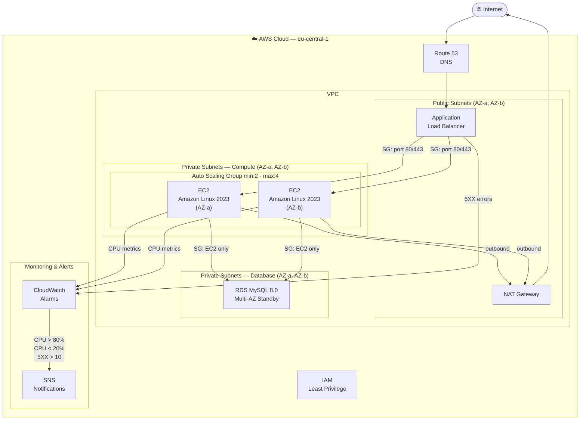

# 🚀 AWS Multi-Tier Infrastructure with Terraform

Production-ready, highly available AWS infrastructure built with Terraform.

---

## 📐 Architecture



---

## ✅ Features

- **VPC** with public and private subnets across 2 Availability Zones
- **Application Load Balancer** for traffic distribution
- **Auto Scaling Group** (min: 2, max: 4 EC2 instances)
- **RDS MySQL Multi-AZ** for high availability database
- **NAT Gateway** for secure outbound internet access
- **CloudWatch Alarms** for CPU and error monitoring
- **SNS Notifications** for real-time alerts
- **IAM** least privilege security

## 🛠️ Tech Stack

- AWS (VPC, EC2, ALB, ASG, RDS, CloudWatch, SNS)
- Terraform (Infrastructure as Code)
- Amazon Linux 2023
- MySQL 8.0

## 📁 Project Structure
```
aws-multi-tier-infra/
├── main.tf
├── variables.tf
├── outputs.tf
├── terraform.tfvars
└── modules/
    ├── networking/
    ├── compute/
    └── database/
```

## 🚀 Deploy

```bash
terraform init
terraform plan
terraform apply
```

## 🗑️ Destroy

```bash
terraform destroy
```

## 📊 Monitoring

CloudWatch alarms configured for:
- EC2 CPU > 80% → SNS alert
- EC2 CPU < 20% → SNS alert
- ALB 5XX errors > 10 → SNS alert


